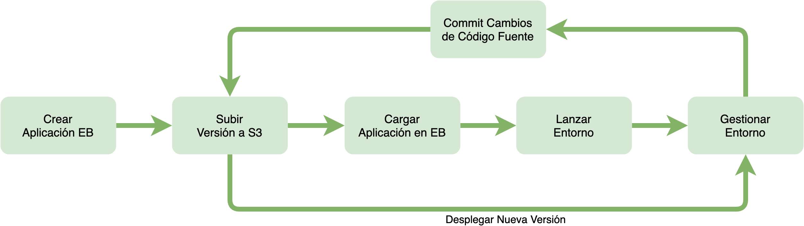
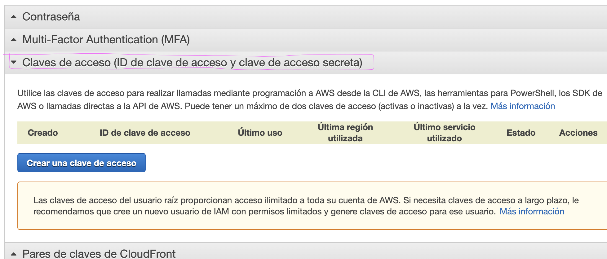
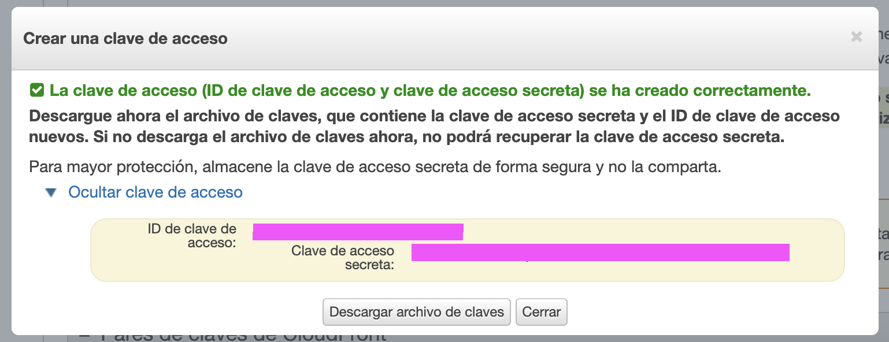

# Despliegue en AWS Elastic Beanstalk

En este test se configura el proyecto para ser desplegado en AWS Elastic Beanstalk (AWSEB) sobre una 
infraestructura totalmente escalable y auto-gestionada.

Con AWSEB maneja automáticamente los detalles de aprovisionamiento de capacidad, 
equilibrio de carga, el escalado y el monitoreo del estado de las aplicaciones. Para más información 
sobre AWSEB diríjase a la 
[Documentación oficial](https://docs.amazonaws.cn/en_us/elasticbeanstalk/latest/dg/Welcome.html).

## Flujo de trabajo

En este proyecto se usará la `interfaz de línea de comandos de AWS Beanstalk (awsebcli)`, una 
herramienta que le ayuda a desplegar y gestionar las aplicaciones de AWSEB.

`awsebcli` crea una aplicación en el panel de AWSEB, crea una versión de la aplicación en forma de 
un paquete (por ejemplo, un archivo .war de Java o .zip en Python), lo almacena en AWS S3 para ser 
usado en el proceso de despliegue de los servidores, carga el paquete en AWSEB, lanza automáticamente 
un entorno, crea y configura los recursos (instancias de EC2, balanceadores de carga, alertas, etc.) 
necesarios de AWS necesarios para ejecutar el código fuente. Una vez creado el entorno, puede 
administrarlo e implementar nuevas versiones de la aplicación.

`awsebcli` se integra con Git, haciendo que se despliegue únicamente el código fuente que haya sido 
'commited' en el repositorio.



## Prerequisitos

* Python 3.8
* PIP
* Pipenv

## Paso a paso

`awsebcli` se distribuye como un [paquete de Python](https://pypi.org/project/awsebcli/) y requiere 
de un entorno virtual para gestionar las dependencias, puede usar `pipenv` o `virtualenv`; en esta 
prueba usamor `pipenv`.

Instale `awsebcli` en el entorno virtual con el siguiente comando:

```shell
pipenv install awsebcli

# compruebe la instalación con
eb --version
```

Compruebe que no existen inconsistencias con las dependencias del proyecto; en algunas ocaciones 
`awsebcli` puede tener problemas con las dependencias de `graphene-django`. `awsebcli` usará el 
archivo `Pipfile.lock` para resolver las dependencias del proyecto durante el proceso de despliegue.

Ahora, es necesario crear los archivos que serán usados para configurar toda la infraestructura que 
servirá el proyecto, para ello cree un directorio con el nombre `.ebextensions`. Dentro del 
directorio `.ebextensions` agregue un archivo django.config con el siguiente contenido:

```yaml
option_settings:
  aws:elasticbeanstalk:container:python:
    WSGIPath: testapp.wsgi:application
  aws:elasticbeanstalk:environment:proxy:staticfiles:
    /static: static
  aws:ec2:instances:
    InstanceTypes: 't3a.nano'
```

Cree otro archivo llamado `.ebextensions/commands.config` con el siguiente contenido:

```yaml
container_commands:
  collectstatic:
    command: "source $(find /var/app/venv/ -name activate) && python manage.py collectstatic --noinput"
  migrate: 
    command: "source $(find /var/app/venv/ -name activate) && python manage.py migrate --noinput"
    leader_only: true
```

El parámetro `container_commands` agrupa los comandos que se ejecutarán en el momento del despliegue 
del proyecto en AWSEB; en esta prueba ejecutamos el comando que recolecta los archivos estáticos y el 
comando que ejecuta las migraciones de base de datos. Asegúrese que el nombre de la carpeta de 
estáticos (`STATIC_ROOT`) corresponde con el valor del parámetro 
`aws:elasticbeanstalk:environment:proxy:staticfiles` en el archivo `django.config`. El parámetro 
`leader_only` hace que el comando se ejecute unicamente en el servidor raíz y no en los servidores de 
escalamiento.

El parámetro `WSGIPath` especifica la ubicación de la rutina WSGI que usará AWSEB para iniciar la 
aplicación. `InstanceTypes` configura los tipos de instancias EC2 que se usarán en el escalamiento 
automático. Para más información sobre cómo configurar AWSEB a través de los archivos vea la 
[documentación oficial](https://docs.amazonaws.cn/en_us/elasticbeanstalk/latest/dg/ebextensions.html).

Inicialice el repositorio para ser usado por AWSEB con el siguiente comando:

```shell
eb init -p python-3.7 -r us-east-1 django-testapp
```

El comando creará una aplicación en AWSEB con el nombre `django-testapp` en la región `us-east-1` 
(N. Virginia). AWSEB solicitará las credenciales de AWS, para conseguirlas siga los siguientes pasos:

1. Inicie sesión en la consola de AWS
2. En el panel superior, haga clic en su nombre de cuenta y seleccione la opción `Mis credenciales de 
seguridad`

3. Seleccione la opción `Claves de acceso (ID de clave de acceso y clave de acceso secreta)` y luego 
haga clic en el botón `Crear una clave de acceso`

4. Se creará la clave de acceso y la clave de acceso secreta y le permitirá copiarlas desde el enlace 
`Mostrar la clave de acceso` o descargarlas en un archivo `.csv`


Luego de crear la aplicación de AWSEB, ejecute el siguiente comando para configurar el par de claves 
que podrá usar para conectarse a través de SSH a la instancia creada:

```shell
eb init
```

Seleccione el par de llaves si ya tiene alguna creada, o siga los pasos para crear una. El par de 
llaves se creará en el directorio `.ssh`.

Ahora, cree un entorno y despliegue la aplicación con el comando

```shell
eb create django-testapp-env
```

Esto creará un entorno de carga balanceada en AWSEB con el nombre `django-testapp-env`. Puede crear 
el entorno de forma interactiva con el comando ```eb create```.

Cuando el proceso de creación del entorno termine, busque el nombre del dominio en la variable 
`CNAME` del resultadode la ejecución del siguiente comando

```shell
eb status 
  ...
  CNAME: eb-django-testapp.elasticbeanstalk.com
  ...
```

Agrege el dominio dentro de los `ALLOWED_HOSTS` de la configuración de django, luego haga commit de 
los cambios y vuelva a desplegar el proyecto con el comando

```shell
eb deploy
```

Una vez desplegados los cambios podrá acceder a la aplicación desplegada usando el comando

```shell
eb open
```

## Otros comandos importantes

`eb ssh` conecta mediante SSH a la instancia EC2.

`eb platform list` muestra la lista de plataformas disponibles en AWSEB.

`eb terminate` elimina el entorno de ejecución creado en AWSEB. Use este comando para eliminar el 
proyecto de AWSEB.

`eb config` muestra su configuración actual de AWSEB.

`eb use -r us-east-1` cambia la región que usará AWSEB.

`eb printenv` muestra todas las variables de entorno configuradas en los archivos .config

`eb status` muestra el estado actual del entorno.

## Otras consideraciones

* Recuerde crear una rama de release/stagging en la que configure los parámetros del proyecto antes 
de pasar a producción (por ejemplo, credenciales de servicio de correo electrónico, base de datos, 
etc.)

* La plataforma python-3.8 no estaba disponible al momento de la creación de esta prueba, por lo que 
si tiene problemas con la plataforma puede listar las plataformas disponibles con el siguiente comando

```shell
eb platform list
```

* El código fuente de la aplicación se almacena en la ruta: `/var/app/`

* Si ocurrió algún error durante el despliegue de la aplicación o de una de sus versiones, el código 
fuente estará almacenado en el directorio `/var/app/staging`

* Si el despliegue no tuvo errores, el código fuente estará alojado en el directorio 
`/var/app/current`

## Eliminar aplicación de AWSEB

Primero deberá terminar el entorno de ejecución con el siguiente comando:

```shell
eb terminate
```

Luego puede eliminar el directorio `.elasticbeanstalk`, por último, elimine las versiones de la 
aplicación, no olvide checkear la opción para eliminar los archivos almacenados en S3, luego elimine 
la aplicación.

## Conectar a una base de datos Aurora Serverless

Aurora Serverless es un tipo de base de datos de AWS RDS con configuración de escalado automático, 
para mayor información sobre Aurora haga clic 
[aquí](https://aws.amazon.com/es/rds/aurora/serverless/).

## Instalación

Ejecute los siguientes comandos en una terminal:

```bash
# instalar dependencias
$ pipenv install

# crear la base de datos
$ pipenv run python manage.py migrate

# llena la base de datos con registros dummy
$ pipenv run python manage.py loaddata populate.json

# crea un usuario administrador
$ pipenv run python manage.py createsuperuser
```

El archivo `populate.json` incluye diferentes usuarios cuya contraseña es su mismo nombre de uuario,
y un super usuario con credenciales `root:root`.

## Despliegue

Puede desplegar este proyecto en un ambiente productivo para ejecutar sus pruebas en un entorno lo 
más real posible, para ello realice las configuraciones que requieren atención en el archivo 
[`testapp/settings/production.py`](testapp/settings/production.py), luego cambie el nombre del achivo 
de configuración usado por Django en [`manage.py`](manage.py#L8) así:

```python
# de
os.environ.setdefault('DJANGO_SETTINGS_MODULE', 'testapp.settings.development')

# a esto
os.environ.setdefault('DJANGO_SETTINGS_MODULE', 'testapp.settings.production')
```

# TODO
Base de datos (Aurora serverless) ~ paquetes desde .ebextensions
Certificado digital
graphql
WAF + managed rules (core rule set)
